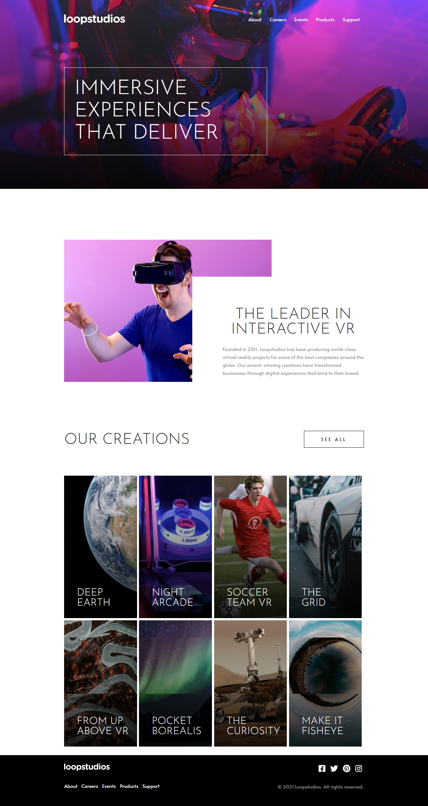
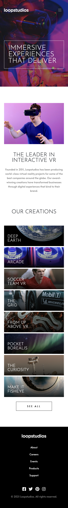

# Loopstudios landing page

This repository contains the solution for the LoopStudios Landing Page challenge from Frontend Mentor. The challenge involves creating a responsive landing page for LoopStudios based on a provided design. The project showcases HTML, CSS, and possibly some JavaScript to achieve the desired layout and interactions. \
<b>Live Site URL:</b> https://justynakantyka.github.io/loopstudios-landing-page/ \
This is a solution to the [Loopstudios landing page challenge on Frontend Mentor](https://www.frontendmentor.io/challenges/loopstudios-landing-page-N88J5Onjw). 

## Table of contents

- [Overview](#overview)
  - [The challenge](#the-challenge)
  - [Screenshot](#screenshot)
  - [Links](#links)

## Overview

### The challenge

Users should be able to:

- View the optimal layout for the site depending on their device's screen size
- See hover states for all interactive elements on the page

### Screenshot
Desktop:\

\
\
\
Mobile:\

### Links

- Live Site URL: https://justynakantyka.github.io/loopstudios-landing-page/
